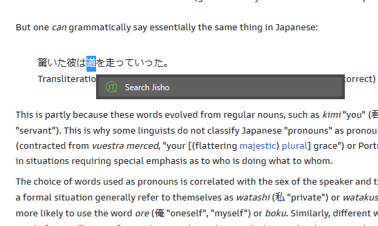

#  &nbsp;&nbsp;Jisho Tansaku

Unofficial Chrome extension for conveniently looking up and displaying words using [Jisho.org](https://jisho.org/).

## Features

- Search by clicking on popup and typing into searchbar
- Search via context-menu on highlighted text
- Resizable and moveable interface

## Usage
- **Clicking Icon (Recommended to pin to toolbar)**


- **Context Menu**


## Disclaimer

The core functionality of this extension is all depenent on the abiltiy to scrape the HTML of Jisho.org. Thus, the extension may suddenly cease to work should the HTML undergo major changes. 

## Support
Let me know of any bugs you encounter or suggestions for improvement by opening an issue on the Github repo, thanks!

## Installation

1. Download `archive.zip` from [releases page](https://github.com/NoahTN/jisho-tansaku/releases) and unzip it into the directory of choice
2. Open the Extension Management page by navigating to `chrome://extensions`
3. Enable Developer Mode by clicking the toggle switch next to **Developer mode**
4. Click the **LOAD UNPACKED** button and select the unpacked directory named `build`


## Development

```bash
# install dependencies
npm init

# build extension
npm run build

# build and watch extension
npm run dev

# run Playwright tests
npm run test
```
