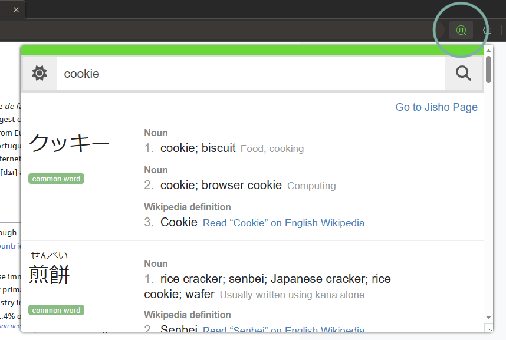

#  &nbsp;&nbsp;Jisho Tansaku

Unofficial Chrome extension for conveniently looking up and displaying words from [Jisho.org](https://jisho.org/).

## Features

- Search the [Jisho API](https://jisho.org/api/v1/search/words?keyword=cookie) by clicking on popup and typing into searchbar
- Search via context-menu on highlighted text
- A resizable and moveable interface

## Usage
- **Clicking Icon (Recommended to pin to toolbar)**



- **Context Menu**


## Support
Let me know of any bugs you encounter or suggestions for improvement by opening an issue on the Github repo, thanks!

Note that this extension in its current state is dependent on data provided by the Jisho API, and thus the availability of certain features (Ex: sentence searching) is largely limited to what is provided by it.

## Installation

1. Download `build.zip` from [releases page](https://github.com/NoahTN/jisho-tansaku/releases)
2. Open the Extension Management page by navigating to `chrome://extensions`
3. Enable Developer Mode by clicking the toggle switch next to **Developer mode**
4. Drag build.zip into the window


## Development

```bash
# install dependencies
npm init

# build extension
npm run build

# build and watch extension
npm run dev

# run Playwright tests
npm run test
```
